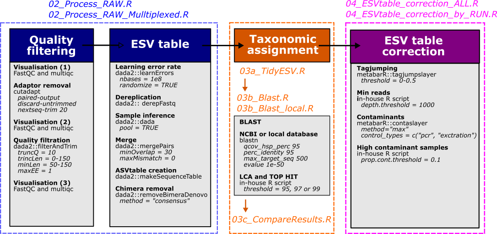

# MLI metabarcoding pipeline

**Currrent version : 0.1.1**  
Check [this page](https://github.com/GenomicsMLI-DFO/MLI_metabar_pipeline/releases) for previous versions of the pipeline

__Main author:__  Audrey Bourret  
__Affiliation:__  Fisheries and Oceans Canada (DFO)   
__Group:__        Laboratory of genomics   
__Location:__     Maurice Lamontagne Institut  
__Affiliated publication:__  
__Contact:__      e-mail: audrey.bourret@dfo-mpo.gc.ca 

- [Description](#description)
- [Status](#status)
- [How to use the pipeline](#how-to-use-the-pipeline)
  + [Pre-requisite](#pre-requisite)
  + [Before starting an analysis](#before-starting-an-analysis)
  + [Rename raw files](#rename-raw-files)
  + [From raw reads to ESV table](#from-raw-reads-to-esv-table)
  + [Taxonomic assignments](#taxonomic-assignments)
  + [Deal with negative samples](#deal-with-negative-samples)
  + [Create an automatic report](#create-an-automatic-report)
- [Example](#example)
- [Limitation](#limitations)
- [Reference](#references)

## Description 

Welcome to the template repository to use the latest version of the MLI metabarcoding pipeline. This pipeline is intended to run in R (and Rstudio) using a few scripts, but need a few external programs too (see [pre-requisite section](#pre-requisite)). This pipeline can run on multiple pre-defined loci, or new ones too.




## Status
Ongoing-improvements

## How to use the pipeline

### Pre-requisite

The R scripts should be run line by line within an intregrated development environment (IDE) such as [Rstudio](https://posit.co/download/rstudio-desktop/). Some external programs are also required:
  - [fastqc](https://www.bioinformatics.babraham.ac.uk/projects/fastqc/)
  - [multiqc](https://multiqc.info/)
  - [cutadapt](https://cutadapt.readthedocs.io/en/stable/)
  - [blast](https://blast.ncbi.nlm.nih.gov/Blast.cgi?CMD=Web&PAGE_TYPE=BlastDocs&DOC_TYPE=Download)

To be sure that the external command are found by R, try to run the test script **01_Code/00_Check_External_Program.R**, or these command directly:

```{r}
system2("fastqc", "--help")
system2("multiqc", "--help")
system2("cutadapt", "--help")
system2("blastn", "--help")
```

MultiQC and cutadapt can be installed in a python environment that should be added to the R path through the  [Option.txt](Option.txt) file, or this command line:

```{r}
Sys.setenv(PATH = paste(c("/path/to/PythonVenv/bin",
                          Sys.getenv("PATH")),
                          collapse = .Platform$path.sep))
```
### Before starting an analysis

- Press the big **Use this template** button in the top of this page to get your own copy of this pipeline (or download the .zip version through the Code button if your are not familiar with github).
- Put raw fastq files into the *00_Data/01a_RawData* folder (examples files can be found [here](https://github.com/GenomicsMLI-DFO/MLI_metabar_example_dataset))
- Fill the [SeqInfo.csv](00_Data/00_FileInfos/SeqInfo.csv) file within  the 00_Data/00_FileInfos folder 
- If the are not already present, install the depending R package : `readr`, `tidyr`, `magrittr`,`dplyr`,`stringr`,`here`,`parallel`, `ggplot2`, `ggforce`

This can be done all at once with this command line in R :

```{r}
install.packages(c("readr", "tidyr", "magrittr", "dplyr", "stringr", "here", "parallel", "ggplot2", "ggforce"))
```
Somes are from biostrings : `dada2`, `Biostrings`, `biomformat`

```{r}
if (!requireNamespace("BiocManager", quietly = TRUE))
    install.packages("BiocManager")
 
BiocManager::install("Biostrings")
BiocManager::install("dada2")
BiocManager::install("biomformat")
```

Others are on github : `metabaR`

```{r}
if (!requireNamespace("remotes", quietly = TRUE))
    install.packages("remotes")
remotes::install_github("metabaRfactory/metabaR")
```
 - Check that parameter sets in [Option.txt](Option.txt) are alright (Locus to perform, N cores available)
 
 Current loci already set are the following :

| Primer | F | R | Ref |
--- | --- | --- | --- | 
|COI|GGWACWGGWTGAACWGTWTAYCCYCC|TAIACYTCIGGRTGICCRAARAAYCA| |	
|MiFishU|GTCGGTAAAACTCGTGCCAGC|CATAGTGGGGTATCTAATCCCAGTTTG| |	
|MiMam|GGGTTGGTAAATTTCGTGCCAGC|CATAGTGGGGTATCTAATCCCAGTTTG| |	
|12SElas02|GTTGGTHAATCTCGTGCCAGC|CATAGTAGGGTATCTAATCCTAGTTTG| |	
|12SMarVer1|CGTGCCAGCCACCGCG|GGGTATCTAATCCYAGTTTG| |
|16Schord|ATGCGAGAAGACCCTRTGGAGCT|CCTNGGTCGCCCCAAC| |	

Other loci can be added, but you'll need to set new parameters in Options.txt, and 00_Code/Parameters folder.

### Rename raw files

To be process, fastq files must be rename as **SAMPLENAME_MARKER_R1or2.fastq.gz**. This can be done with one of the two following scripts:

#### Rename option 1 : Only remove sequencer/run id pattern

Use **01_Rename_RAW_SeqPattern.R** within *01_Code* folder to rename zipped fastq files on demultiplexed data. It will remove these patterns :

MiSeq

"MI.M*00000*_*0000*.*000*.FLD*0000*."

NovaSeq 

"NS.*0000*.*000*.FLD*0000*.*0000*---PE1-CS1-IDT_i5_*0*."

"NS.*0000*.FLD*0000*---PE1-CS1-IDT_i5_*0*."

Other patterns or transformation can be implemented

#### Rename option 2 : Start from file ID name 

Use **01_Rename_RAW_FileName.R** within *01_Code* folder to rename zipped fastq files on demultiplexed data. It will used the metadata file (*SeqInfo.csv*) to create a new name. File name must exclude the **_R1orR2.fastq.gz** part.

Use **01_Rename_RAW_FileName_Multiplex.R** within *01_Code* folder to rename zipped fastq files on multiplexed data (same sample but at different loci). It will used the metadata file (*SeqInfo.csv*) to create a new name. File name must exclude the **_R1orR2.fastq.gz** part, and should be repeated to all samples multiplexed together. 

### From **raw reads** to **ESV table**

Use the file **02_Process_RAW.R** within *01_Code* folder to transform raw reads into an ESV table on demultiplex data. 

Use the file **02_Process_RAW_Multiplexed.R** within *01_Code* folder to transform raw reads into an ESV table on multiplex data (same sample but at different loci). 


These are the steps:
1. fastQC and multiQC on raw reads
2. Cutadapt to check for and remove adaptors (followed by a second fastQC/multiQC)
	- The option novaseq TRUE/FALSE allowed to used to option -nextseq-trim=20
3. dada2 filtering (followed by a third fastQC/multiQC)
4. dada2 error rate assessment
5. dada2 dereplication, sample inference and merging
6. dada2 chimera removal

### Taxonomic assignments

Use the file **03_TaxoAssign_Blast.R** within *01_Code* folder to perform basic blast assignment with LCA and Tophit at 95, 97, and 99 thresholds. 

You will need a local version of NCBI-nt database to run this script. Check [here](https://blast.ncbi.nlm.nih.gov/Blast.cgi?CMD=Web&PAGE_TYPE=BlastDocs&DOC_TYPE=Download) for more info.  

### Deal with negative samples

```
# install bioconductor dependencies
install.packages("BiocManager")
BiocManager::install("biomformat")

# install metabaR package
install.packages("remotes")
remotes::install_github("metabaRfactory/metabaR")
```

This script will generate, for each loci, ~ 10 figures + corrected output. Theses figures are not that easy to understand, but you can check on the [metabar website](https://metabarfactory.github.io/metabaR/articles/metabaRF-vignette.html) how they interpreted them. There's 2 parameters that needed to be set (at lines 211, 298 and 346), which are 1) the minimum number of reads for a sample to be keep (set to 1000), 2) the maximum proportion of contaminants a sample must have (set to 10%) and 3) the lower limit of relative frequence of a particular ESV must be (the tagjump parameters, set to 1%). 

You will also need to add 2 columns in the SeqInfo.csv, tag_fwd and tag_rev. 

### Create an automatic report

Check the *03_Report* folder

## Example

A test dataset can be downloaded here: https://github.com/GenomicsMLI-DFO/MLI_metabar_example_dataset

Put these files within the **00_Data/01a_Raw_Data** folder.

4 samples at the COI marker, both F (R1) and R (R2).

## Limitations

While entire R scripts can be send through the command line, sending lines by lines part of the script through Rstudio is preferred.


## References
